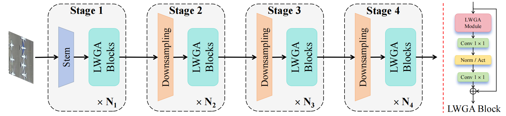

# LWGANet: A Lightweight Group Attention Backbone for Remote Sensing Visual Tasks

This is the official Pytorch/Pytorch implementation of the paper: <br/>
> **LWGANet: A Lightweight Group Attention Backbone for Remote Sensing Visual Tasks**
>
> Wei Lu, Si-Bao Chen*, Chris H. Q. Ding, Jin Tang, and Bin Luo, Senior Member, IEEE 
> 
>  *IEEE Transactions on Image Processing (TIP), In peer review.* [arXiv](https://arxiv.org/abs/2501.10040)
> 

----


----

<p align="center"> 

<p align="center">  Illustration of LWGANet architecture.
</p> 

----


<details>
  <summary>
  <font size="+1">Abstract</font>
  </summary>

Remote sensing (RS) visual tasks have gained significant academic and practical importance. However, they encounter numerous challenges that hinder effective feature extraction, including the detection and recognition of multiple objects exhibiting substantial variations in scale within a single image. While prior dual-branch or multi-branch architectural strategies have been effective in managing these object variances, they have concurrently resulted in considerable increases in computational demands and parameter counts. Consequently, these architectures are rendered less viable for deployment on resource-constrained devices. Contemporary lightweight backbone networks, designed primarily for natural images, frequently encounter difficulties in effectively extracting features from multi-scale objects, which compromises their efficacy in RS visual tasks. This article introduces LWGANet, a specialized lightweight backbone network tailored for RS visual tasks, incorporating a novel lightweight group attention (LWGA) module designed to address these specific challenges. The LWGA module, tailored for RS imagery, adeptly harnesses redundant features to extract a wide range of spatial information, from local to global scales, without introducing additional complexity or computational overhead. This facilitates precise feature extraction across multiple scales within an efficient framework. LWGANet was rigorously evaluated across twelve datasets, which span four crucial RS visual tasks: scene classification, oriented object detection, semantic segmentation, and change detection. The results confirm LWGANet's widespread applicability and its ability to maintain an optimal balance between high performance and low complexity, achieving state-of-the-art results across diverse datasets. LWGANet emerged as a novel solution for resource-limited scenarios requiring robust RS image processing capabilities.
</details>


## Pre-train Weights on Imagenet-1k

Imagenet 300-epoch pre-trained LWGANet-L0 backbone: [Download](https://github.com/lwCVer/LWGANet/releases/download/weights/lwganet_l0_e299.pth)

Imagenet 300-epoch pre-trained LWGANet-L1 backbone: [Download](https://github.com/lwCVer/LWGANet/releases/download/weights/lwganet_l1_e299.pth)

Imagenet 300-epoch pre-trained LWGANet-L2 backbone: [Download](https://github.com/lwCVer/LWGANet/releases/download/weights/lwganet_l2_e296.pth)

## Get Started

### [Image Classification](./classification/README.md)

- [Dependency Setup](./classification/README.md#Dependency)
- [Dataset Preparation](./classification/README.md#Dataset)
- [Training Steps](./classification/README.md#Training)
- [Experimental Results](./classification/README.md#Results)

----

### [Object Detection](./detection/README.md)

- [Dependency Setup](./detection/README.md#Dependency)
- [Training Steps](./detection/docs/en/get_started.md)
- [Experimental Results](./detection/README.md#Results)

----

### [Semantic Segmentation](./segmentation/README.md)

- [Dependency Setup](./segmentation/README.md#Dependency)
- [Dataset Preparation](./segmentation/README.md#Dataset)
- [Training Steps](./segmentation/README.md#Training)
- [Experimental Results](./segmentation/README.md#Results)

----

### [Change Detection](./change_detection/README.md)

- [Dependency Setup](./change_detection/README.md#Dependency)
- [Dataset Preparation](./change_detection/README.md#Dataset)
- [Training Steps](./change_detection/README.md#Training)
- [Experimental Results](./change_detection/README.md#Results)

----

## Star History

[](https://star-history.com/#lwCVer/LWGANet&Date)

## Acknowledgement
This repository is built using the [timm](https://github.com/rwightman/pytorch-image-models), [mmrotate](https://github.com/open-mmlab/mmrotate),   [unetformer](https://github.com/WangLibo1995/GeoSeg), [A2Net](https://github.com/guanyuezhen/A2Net), and [CLAFA](https://github.com/xingronaldo/CLAFA) repositories.

If you have any questions about this work, you can contact me. Email: luwei_ahu@qq.com.

Your star is the power that keeps us updating github.

## Citation
If LWGANet is useful or relevant to your research, please kindly recognize our contributions by citing our paper:
```
@article{lu2025lwganet,
  title={LWGANet: A Lightweight Group Attention Backbone for Remote Sensing Visual Tasks},
  author={Lu, Wei and Chen, Si-Bao and Ding, Chris HQ and Tang, Jin and Luo, Bin},
  journal={arXiv preprint arXiv:2501.10040},
  year={2025}
}
```

