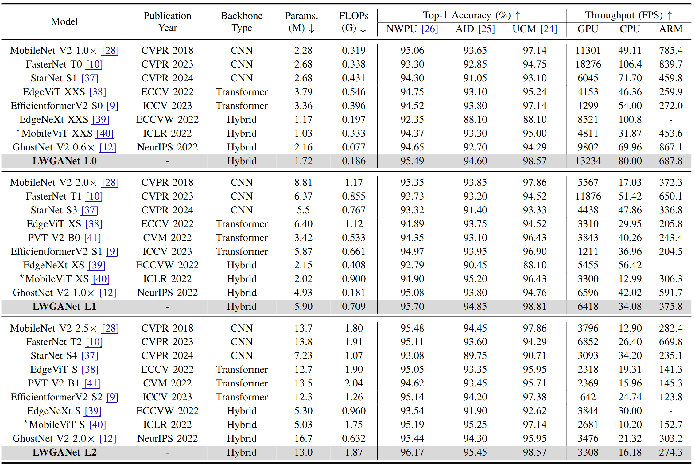

# LWGANet: A Lightweight Group Attention Backbone for Remote Sensing Visual Tasks

This is the official Pytorch/Pytorch implementation of the paper: <br/>
> **LWGANet: A Lightweight Group Attention Backbone for Remote Sensing Visual Tasks**
>
> Wei Lu, Si-Bao Chen*, Chris H. Q. Ding, Jin Tang, and Bin Luo, Senior Member, IEEE 
> 
>  *IEEE Transactions on Image Processing (TIP), In peer review.* [arXiv](https://arxiv.org/abs/2501.10040)
> 

----

<p align="center"> 

<p align="center">  Illustration of LWGANet architecture.
</p> 

----


# Get Started

## Dependency
Create an new conda virtual environment
```
conda create -n LWGANet python=3.9 -y
conda activate LWGANet
conda install pytorch==1.10.0 torchvision==0.11.0 torchaudio==0.10.0 cudatoolkit=11.3 -c pytorch -c conda-forge
```
Clone this repo and install required packages:
```
git clone https://github.com/lwCVer/LWGANet
cd LWGANet/classification/
pip install -r requirements.txt
```

## Dataset

You can download our already sliced datasets (
[NWPU-RESISC45](https://pan.baidu.com/s/1_HRh9mpuWGpT2FhG_Fmokw?pwd=CV21),  [AID](https://pan.baidu.com/s/1-4vtpBianvueNJSQ395p2w?pwd=CV21) and [UCM](https://pan.baidu.com/s/1u5a6Z5d-awX133WJcl-Gkw?pwd=CV21) datasets.  
password: CV21), or download the classification datasets from the official document and structure the data as follows:
```
/path/to/dataset/
  train/
    class1/
      img1.jpeg
    class2/
      img2.jpeg
  val/
    class1/
      img3.jpeg
    class2/
      img4.jpeg
```


## Training

```
sh train_all.sh
```


## Results

----

<p align="center"> 

<p align="center">  
Eperimental results on NWPU, AID, and UCM classification datasets. The symbol ‘⋆’ indicated a training image size of 256×256. FPS were acquired through execution on both the NVIDIA GeForce RTX 3090 (GPU), Intel i9-11900K (CPU), and NVIDIA AGX-XAVIER (ARM) platforms with batch sizes of 256, 16, and 32, respectively.
</p>  

----

<p align="center"> 

<p align="center">  
Comprehensive comparison of top-1 accuracy, FPS, and parameters on the NWPU, AID, and UCM datasets. The area of each circle was proportional to the number of parameters in model. LWGANet with red circles achieved the best balance.
</p>  

----
